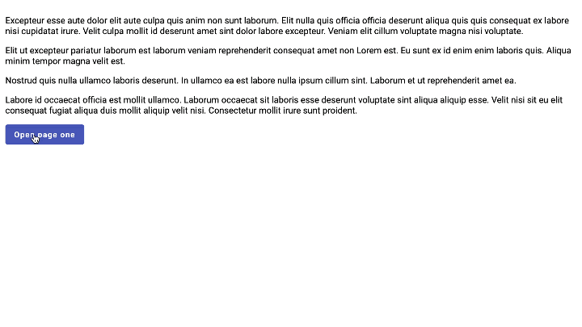

# SlideOutStack

A service that controls a stack of slideout elements.

## Overview

The `SlideOutStackController` provides methods to manage a stack of slideout elements in an Angular application. Slideout elements are components that can be presented and dismissed with animations.



## Installation

```bash
npm install @molinet/slideout-stack --save
```

### Package dependencies

This package uses [`@angular/cdk`](https://www.npmjs.com/package/@angular/cdk) as a dependency. Run this command to install `@angular/cdk` if you haven't already:

```bash
npm install @angular/cdk
```

### Import styles

Add the styles in your `angular.json` file:

```json
"styles": [
  "./node_modules/@molinet/slideout-stack/styles/styles.scss"
]
```

### Injection

Inject `SlideOutStackController` into your component or service:

```typescript
import { SlideOutStackController } from "@molinet/slideout-stack";

public constructor(private slideOutStackCtrl: SlideOutStackController) { }
```

## API Reference

### Methods

#### `config(options: SlideOutStackOptions): void`

Configures the global options for the slideouts. When a slideout is pushed without options, the global options will be used.

| Parameter | Type | Description |
| -- | -- | -- |
| `options` | [`SlideOutStackOptions`](#slideoutstackoptions) | Default options for all the slideouts. |

#### `push(params: SlideOutStackParams): SlideOutElement`

Pushes and displays a new [`SlideOutElement`](#slideoutelement) to the stack.

Custom data can be passed to the component with the `params.properties` parameter.

The [`SlideOutElement`](#slideoutelement) will be presented with the `params.options` passed.

If an option is not passed, the global option configured with the `config` method will be used.

If no global option is configured, the default option will be used.

| Parameter | Type | Description |
| -- | -- | -- |
| `params` | [`SlideOutStackParams`](#slideoutstackparams) | The parameters for the slideout. |

Returns a [`SlideOutElement`](#slideoutelement) representing the pushed slideout.

#### `pop(): void`

Pops the top [`SlideOutElement`](#slideoutelement) from the stack if exists. It will be dismissed with the `params.options` passed in the `push` method.

### Interfaces

#### `SlideOutStackOptions`

| Property | Type | Description |
| -- | -- | -- |
| `animationDuration` | number | (optional) Duration of the animation in milliseconds. Default is `400`. |
| `backdropDismiss` | boolean | (optional) Indicates whether clicking on the backdrop should dismiss the slideout. Default is `false`. |
| `backdropOpacity` | number | (optional) Opacity of the backdrop between `0` and `1`. Default is `0.3`. Note: backdrop color is black. |
| `fromEdge` | type | (optional) The edge from which the slideout should appear. Possible values are `left` and `right`. Default is `right`. |
| `width` | string | (optional) Width of the top slideout. Default is `80%` of the window total width. It can also be set in pixels (e.g. `250px`). |

#### `SlideOutStackParams`

| Property | Type | Description |
| -- | -- | -- |
| `component` | ComponentType\<any> | The component to be presented into the slideout. |
| `properties` | { [key: string]: any } | (optional) Custom data to pass to the component. |
| `options` | [`SlideOutStackOptions`](#slideoutstackoptions) | (optional) Options for the slideout. |

#### `SlideOutElement`

| Property | Type | Description |
| -- | -- | -- |
| `component` | ComponentRef\<any> | The component reference of the slideout. |
| `onDismissed` | Promise\<void> | Returns a promise that resolves when the slideout dismisses. |

## Example

`app-example.component.ts`

```typescript
import { ComponentType } from '@angular/cdk/portal';
import { Component, OnInit } from '@angular/core';
import { SlideOutStackController } from '@molinet/slideout-stack';
import { MyComponent } from './my-component';

@Component({
  selector: 'app-example',
  template: `
    <button (click)="pushSlideOut()">Open slideout</button>
  `
})
export class ExampleComponent implements OnInit {

  public constructor(
    private slideOutStackCtrl: SlideOutStackController
  ) { }

  public ngOnInit(): void {
    // Configure some global options
    this.slideOutStackCtrl.config({
      animationDuration: 1500,
      backdropDismiss: true
    });
  }

  public pushSlideOut(): void {
    // Push a new slideout onto the stack
    this.slideOutStackCtrl.push({
      component: MyComponent,
      properties: {
        data: 'Custom data'
      },
      options: {
        animationDuration: 500, // Will override the global option
        backdropOpacity: 0.5,
        fromEdge: 'right',
        width: '70%'
      }
    }).onDismissed.then(() => {
      // Occurs when the component has been popped
      console.log('MyComponent dismissed');
    });
  }

  popSlideOut() {
    // Pop the top slideout from the stack
    this.slideOutStackCtrl.pop();
  }
}
```

`my-component.component.ts`

```typescript
import { Component, OnInit } from '@angular/core';

@Component({
  selector: 'my-component',
  template: `
    <p>My component works!</p>
  `
})
export class MyComponent implements OnInit {

  public data!: string;

  public ngOnInit(): void {
    console.log(this.data); // Outputs 'Custom data'
  }
}
```

### License

This library is licensed under the MIT License. See the LICENSE file for details.
